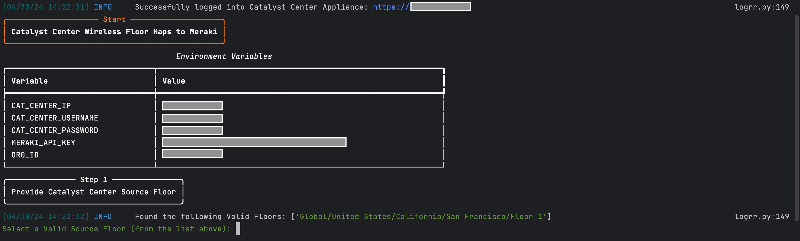
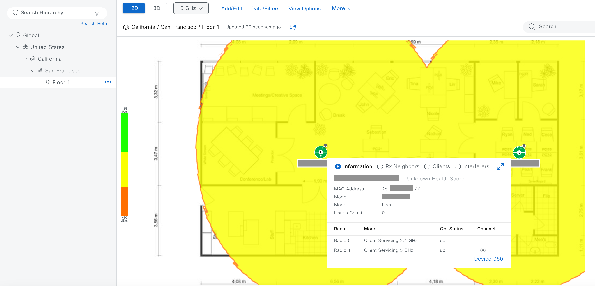
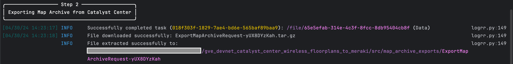
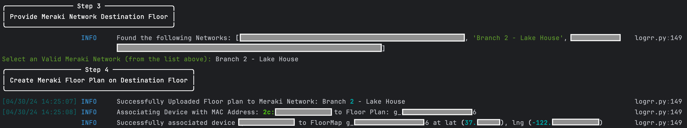
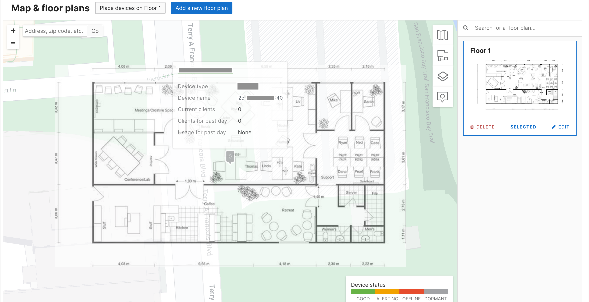

# Catalyst Center Wireless Floor Maps to Meraki Floor Plans

This utility copies Catalyst Center Floor Maps to Meraki Network Floor Plans, uploading the floor plan image and associating devices via MAC Address with the correct Floor Plan in Meraki.

Due to a difference in Catalyst Center Floor Map (X-Y Coordinate) vs Meraki Floor Plan (Latitude, Longitude) schemes, the utility doesn't directly translate the position of devices within Catalyst Center to their corresponding positions within a Meraki Floor Plan. Devices are associated with their Latitude and Longitude set to the Building Address (same as the Meraki Floor Plan Address).
Once associated, the Meraki Floor Plan can be manually adjusted on to the geographical building and associated devices can be placed in their proper positions.

**Note**: Translating devices on a Catalyst Center Floor Map to a Meraki Floor Plan is done by a matching device MAC address. It's assumed the same device in Catalyst Center is claimed and in the correct Meraki network!

## Contacts
* Trevor Maco

## Solution Components
* Catalyst Center 
* Meraki


## Prerequisites

### Catalyst Center Credentials
In order to use the Catalyst Center APIs, you need to make note of the IP address, username, and password of your instance of Catalyst Center. Note these values to add to the credentials file during the installation phase.

### Meraki API Keys
In order to use the Meraki API, you need to enable the API for your organization first. After enabling API access, you can generate an API key. Follow these instructions to enable API access and generate an API key:
1. Login to the Meraki dashboard
2. In the left-hand menu, navigate to `Organization > Settings > Dashboard API access`
3. Click on `Enable access to the Cisco Meraki Dashboard API`
4. Go to `My Profile > API access`
5. Under API access, click on `Generate API key`
6. Save the API key in a safe place. The API key will only be shown once for security purposes, so it is very important to take note of the key then. In case you lose the key, then you have to revoke the key and a generate a new key. Moreover, there is a limit of only two API keys per profile.

> For more information on how to generate an API key, please click [here](https://developer.cisco.com/meraki/api-v1/#!authorization/authorization). 

> Note: You can add your account as Full Organization Admin to your organizations by following the instructions [here](https://documentation.meraki.com/General_Administration/Managing_Dashboard_Access/Managing_Dashboard_Administrators_and_Permissions).

## Installation/Configuration
1. Clone this repository with `git clone [repository name]`. To find the repository name, click the green `Code` button above the repository files. Then, the dropdown menu will show the https domain name. Click the copy button to the right of the domain name to get the value to replace [repository name] placeholder.
2. Rename the `.env_sample` file to `.env` (in `src/config`)
3. Add the Catalyst Center `IP address`, `Username`, and `Password` that you collected in the Prerequisites section to `.env`
```dotenv
# Catalyst Center Section
CAT_CENTER_IP="X.X.X.X"
CAT_CENTER_USERNAME="admin"
CAT_CENTER_PASSWORD="admin"
```
4. Add `Meraki API key` and `Org ID` (found at the bottom of a Meraki Org Webpage) to `.env`
```dotenv
MERAKI_API_KEY="API key goes here"
ORG_ID="Org ID goes here"
```
5. Set up a Python virtual environment. Make sure Python 3 is installed in your environment, and if not, you may download Python [here](https://www.python.org/downloads/). Once Python 3 is installed in your environment, you can activate the virtual environment with the instructions found [here](https://docs.python.org/3/tutorial/venv.html).
6. Install the requirements with `pip3 install -r requirements.txt`

## Usage
To run the program, use the commands:
```
$ cd src
$ python3 migrate.py
```

The utility will log in to Catalyst Center, and Retrieve all Floors in the hierarchy. Select the "source floor" to copy the Floor Map from:





The utility then exports the Map Archive for the floor, saving it to the `map_archive_exports` directory:



The utility will prompt for the Meraki network to upload the floor map too, and it will attempt to associate devices sharing a MAC address with devices on the Catalyst Center Floor Map to the new Meraki Floor Plan (assuming the devices are claimed and in the Meraki network!):



Finally, the new Meraki Floor Plan is created, and it can now be manually edited to overlay the floor plan on the building and place devices in the correct position:




### LICENSE

Provided under Cisco Sample Code License, for details see [LICENSE](LICENSE.md)

### CODE_OF_CONDUCT

Our code of conduct is available [here](CODE_OF_CONDUCT.md)

### CONTRIBUTING

See our contributing guidelines [here](CONTRIBUTING.md)

#### DISCLAIMER:
<b>Please note:</b> This script is meant for demo purposes only. All tools/ scripts in this repo are released for use "AS IS" without any warranties of any kind, including, but not limited to their installation, use, or performance. Any use of these scripts and tools is at your own risk. There is no guarantee that they have been through thorough testing in a comparable environment and we are not responsible for any damage or data loss incurred with their use.
You are responsible for reviewing and testing any scripts you run thoroughly before use in any non-testing environment.